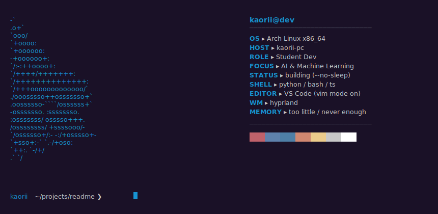

<div align="center">


</div>

```
╔═══════════════════════════════════════════════════════════════════════╗
║  [  OK  ] Started kaorii-dev.service                                 ║
║  [  OK  ] Reached target: passion-for-building                       ║
║  [  OK  ] Loaded: arch x86_64  |  uptime: ∞  |  status: building    ║
╚═══════════════════════════════════════════════════════════════════════╝
```

<div align="center">

[](https://git.io/typing-svg)

</div>

<br/>

<div align="center">



</div>

<br/>

<div align="center">


</div>

<br/>

---

<details open>
<summary><code>❯ cat whoami.txt</code></summary>
<br/>

> I'm **Kao** — student, builder, AI enthusiast.
> I make software that solves real problems, not just demos.
> Currently figuring out how AI can actually improve student life.
> Running on caffeine and `--no-sleep` since forever.

<br/>
</details>

---

<details open>
<summary><code>❯ ls -la ./projects/</code></summary>
<br/>

<div align="center">

| | Project | Description | Stack | Status |
|:---:|:---|:---|:---|:---:|
| 🌸 | **Shiori AI Organizer** | AI desktop app — detects assignments, summarizes announcements, auto-generates study schedules via Google services | `AI` `Google API` `Automation` |  |

</div>

<br/>
</details>

---

<details open>
<summary><code>❯ cat ./logs/learning.log</code></summary>
<br/>

```
  ▸ Machine Learning · TensorFlow   [##########...........]   50%
  ▸ Desktop & Full-Stack Dev         [#############.........]   60%
  ▸ API Integrations & Automation    [########.............]   40%
  ▸ Computer Vision                  [######...............]   30%
```

<br/>
</details>

---

<details open>
<summary><code>❯ cat ./config/interests.json</code></summary>
<br/>

```json
{
  "currently_building": [
    "AI-powered productivity tools",
    "Computer vision systems",
    "Intelligent automation apps",
    "Experimental software projects"
  ],
  "obsessed_with": ["LLMs", "edge inference", "systems that think"],
  "distro": "arch linux (btw)",
  "next_target": "ship something real"
}
```

<br/>
</details>

---

<details open>
<summary><code>❯ pacman -Q | grep stack</code></summary>
<br/>

<div align="center">
<picture>
  
</picture>
</div>

<br/>
</details>

---

<details open>
<summary><code>❯ ./metrics.sh --all --animated</code></summary>
<br/>

<div align="center">

`// metrics.terminal`


</div>

<br/>

<div align="center">

<table border="0" cellspacing="0" cellpadding="8">
<tr>
<td width="50%" align="center">

`// languages.details`


</td>
<td width="50%" align="center">

`// isocalendar`


</td>
</tr>
</table>

</div>

<br/>

<div align="center">

`// isocalendar.terminal`


</div>

<br/>

<div align="center">

`// achievements`


</div>

<br/>
</details>

---

<details open>
<summary><code>❯ git log --oneline --graph --all</code></summary>
<br/>

<div align="center">


&nbsp;&nbsp;


</div>

<br/>

<div align="center">


</div>

<br/>
</details>

---

<details open>
<summary><code>❯ cat /proc/contribution_snake</code></summary>
<br/>

<div align="center">
<picture>
  <source media="(prefers-color-scheme: dark)"  srcset="https://raw.githubusercontent.com/kaorii-ako/kaorii-ako/output/github-contribution-grid-snake-dark.svg">
  <source media="(prefers-color-scheme: light)" srcset="https://raw.githubusercontent.com/kaorii-ako/kaorii-ako/output/github-contribution-grid-snake.svg">
  
</picture>
</div>

<br/>
</details>

<br/>


